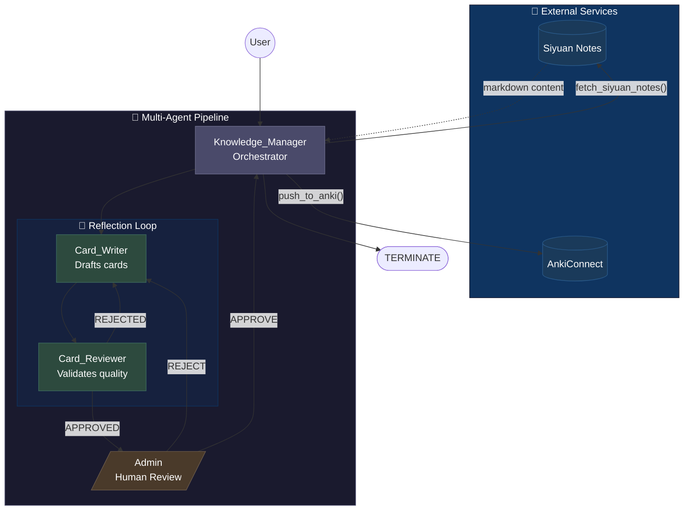

# Autonomous Local Knowledge to Anki Pipeline

A **multi-agent AI system** that extracts knowledge from [Siyuan Notes](https://b3log.org/siyuan/) and generates optimized [Anki](https://apps.ankiweb.net/) flashcards using [Microsoft AutoGen](https://microsoft.github.io/autogen/).

> **Privacy-First**: Runs entirely locally using Ollama with GPU acceleration. No data leaves your machine.


## Agentic Design Patterns

This project demonstrates four key agentic design patterns from the [DeepLearning.AI AutoGen course](https://www.deeplearning.ai/short-courses/ai-agentic-design-patterns-with-autogen/):

| Pattern | Implementation | Description |
|---------|----------------|-------------|
| **Tool Use** | `fetch_siyuan_notes()`, `push_to_anki()` | Agents call external APIs to interact with the real world |
| **Reflection** | Card_Writer ↔ Card_Reviewer loop | Iterative refinement until quality standards are met |
| **Multi-Agent Collaboration** | SelectorGroupChat with 4 agents | Specialized agents with distinct roles working together |
| **Human-in-the-Loop** | Admin approval gate | Human oversight before irreversible actions |

## Features

- **Quality-First Card Generation**: Cards follow [SuperMemo's 20 Rules](https://supermemo.guru/wiki/20_rules_of_knowledge_formulation) (Minimum Information Principle)
- **Iterative Refinement**: Reviewer agent sends cards back for revision until they pass quality checks
- **Human Oversight**: Final approval step before cards are pushed to Anki
- **Local-First**: Works with Ollama or any OpenAI-compatible LLM server - no cloud API keys required
- **GPU Acceleration**: Ollama 0.17+ supports Intel Arc, NVIDIA, and AMD GPUs

## Architecture



**Key Flow:**
1. **Knowledge_Manager** fetches notes from Siyuan
2. **Card_Writer** creates flashcards following the Minimum Information Principle
3. **Card_Reviewer** validates quality → sends back to Writer if REJECTED
4. **Admin** (you) provides final approval
5. **Knowledge_Manager** pushes approved cards to Anki

## Quick Start

### Prerequisites

- **Python 3.13+**
- **[Ollama](https://ollama.com/)** - Local LLM inference (0.17+ recommended for Intel GPU support)
- **Siyuan Notes** with API enabled
- **Anki** with [AnkiConnect](https://ankiweb.net/shared/info/2055492159) plugin

### Installation

```bash
# Clone the repository
git clone https://github.com/yourusername/Autonomous-Local-Knowledge-to-Anki-Pipeline.git
cd Autonomous-Local-Knowledge-to-Anki-Pipeline

# Create virtual environment (using uv)
uv venv
.venv\Scripts\activate  # Windows
# source .venv/bin/activate  # Linux/Mac

# Install dependencies
uv sync
```

### Configuration

```bash
# Copy the example environment file
cp .env.example .env

# Edit .env with your settings
notepad .env  # or your preferred editor
```

Required settings:
- TARGET_BLOCK_ID: The Siyuan block ID containing your notes

### Usage

1. Start Ollama and pull a model:
   ```bash
   ollama serve  # if not already running
   ollama pull qwen3.5:4b  # recommended for function calling
   ```
2. Start Siyuan Notes
3. Start Anki (with AnkiConnect running)
4. Run the pipeline:

```bash
python main.py
```

> **Intel GPU Users**: Ollama 0.17+ automatically detects Intel Arc/Iris GPUs and uses Vulkan acceleration. No extra setup needed!

## Project Structure

```
.
+-- main.py                      # Entry point
+-- src/
|   +-- anki_pipeline/
|       +-- __init__.py
|       +-- agents.py            # Agent definitions and routing logic
|       +-- config.py            # Environment configuration
|       +-- models.py            # Pydantic models for structured output
|       +-- tools.py             # Siyuan and Anki API integrations
+-- pyproject.toml               # Dependencies and project metadata
+-- .env.example                 # Example environment configuration
+-- README.md
```

## Flashcard Quality Standards

Cards are validated against [SuperMemo's 20 Rules of Formulating Knowledge](https://www.supermemo.com/en/blog/twenty-rules-of-formulating-knowledge):

1. **Minimum Information Principle**: One fact per card
2. **No Sets**: Avoid asking for lists of items
3. **Cloze Format**: Use fill-in-the-blank for complex facts
4. **Clean Text**: No formatting artifacts or tags

## LLM Configuration

### Model Requirements

This pipeline requires a model with **strong instruction-following** capabilities to properly execute multi-agent workflows. Smaller models (< 4B parameters) may skip agents or ignore the reflection loop.

### Ollama (Recommended)

Best for local inference with GPU acceleration:

```env
LLM_BASE_URL=http://127.0.0.1:11434/v1
LLM_MODEL_ID=qwen3:4b
```

> ⚠️ **Model Size Warning**: Models smaller than ~4B parameters may not follow multi-agent workflows correctly. They tend to skip agents, ignore the reflection loop, or call tools with placeholder values. Use 4B+ parameter models for reliable results.

### OpenAI (Cloud)

```env
LLM_BASE_URL=https://api.openai.com/v1
LLM_MODEL_ID=gpt-4o-mini
LLM_API_KEY=sk-your-api-key
```

### Other OpenAI-Compatible Servers

Works with LM Studio, vLLM, or any server exposing `/v1/chat/completions`:

```env
LLM_BASE_URL=http://127.0.0.1:YOUR_PORT/v1
LLM_MODEL_ID=your-model-name
```

## Security Considerations

- **No credentials in code**: All secrets loaded from environment variables
- **Local inference**: Default configuration keeps all data on your machine
- **No sensitive data in prompts**: Knowledge content stays within local network
- **Token-based auth**: Siyuan API uses local token authentication

## Technologies

- [AutoGen 0.4+](https://microsoft.github.io/autogen/) - Multi-agent orchestration
- [Pydantic](https://docs.pydantic.dev/) - Data validation and structured output
- [Ollama](https://ollama.com/) - Local LLM inference with GPU acceleration (Intel, NVIDIA, AMD)
- [Siyuan Notes](https://b3log.org/siyuan/) - Local-first knowledge management
- [AnkiConnect](https://foosoft.net/projects/anki-connect/) - Anki automation API

## License

MIT License - see [LICENSE](LICENSE) for details.

---

Built with the [AI Agentic Design Patterns with AutoGen](https://www.deeplearning.ai/short-courses/ai-agentic-design-patterns-with-autogen/) course from DeepLearning.AI
